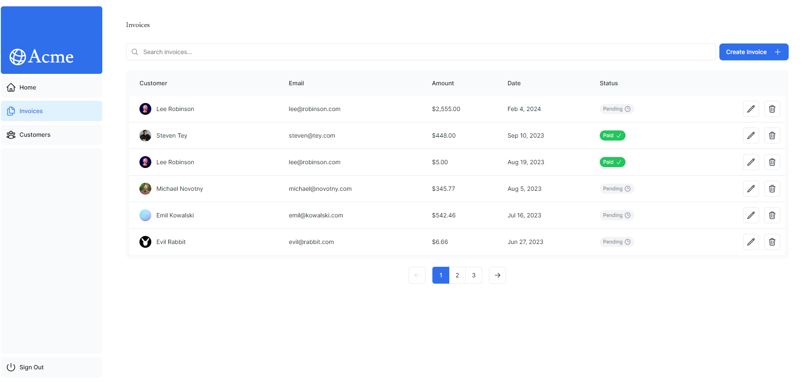

## Next.js App Router Course - Starter

This is the starter template for the Next.js App Router Course. I have developed this project along with the documentation to learn NextJS after an introduction to React

In this project i have implemented Searching, paging, authentication, server actions, dynamic rendering, streaming, App Router etc. and as Database i used PostgreSQL and accessed it through server actions without needing middle layers.
This project has great examples of this subjects thanks to NextJS documentation and developing this app helped me to get a broad view of NextJS

For more information, see the [course curriculum](https://nextjs.org/learn) on the Next.js Website.
